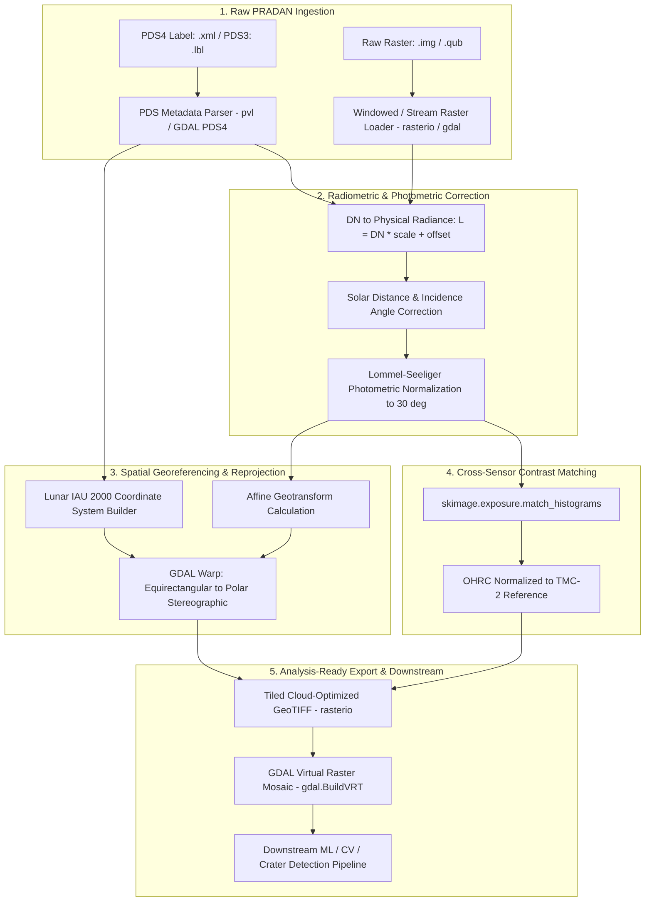

# Chandrayaan-2 Planetary Imagery Preprocessing Pipeline: Complete Project Handoff

**Author / Role**: Planetary Data Engineer (Antigravity Pair Programmer)  
**Project**: Chandrayaan-2 Analysis-Ready Data (ARD) Pipeline  
**Target Instruments**: OHRC (Orbiter High Resolution Camera), TMC-2 (Terrain Mapping Camera-2), IIRS (Imaging Infrared Spectrometer)  
**Data Source**: ISRO PRADAN / ISSDC Archive  
**Workspace Location**: `C:\Users\piyus\.gemini\antigravity\scratch\ch2_lunar_pipeline`  
**Active Conda Environment**: `lunar` (Python 3.10)  

---

## 1. Executive Summary & Objective

In planetary hackathons and computer vision tasks (crater detection, boulder hazard identification, landing site selection, DEM generation), the primary bottleneck is getting raw, uncalibrated, unprojected planetary spacecraft telemetry into a standardized, analysis-ready format.

This project delivers a **dual-engine (OSGeo GDAL + Rasterio) preprocessing pipeline** that converts raw Chandrayaan-2 PDS3 and PDS4 datasets into:
1. **Physical Reflectance ($I/F \in [0.0, 1.0]$)** normalized via the **Lommel-Seeliger law** (invariant to spacecraft viewing time and sun angle).
2. **Cross-sensor histogram-matched imagery** (harmonizing 0.25 m/px OHRC high-res swaths with 5.0 m/px TMC-2 regional swaths).
3. **True IAU 2000 Lunar Georeferenced Cloud-Optimized GeoTIFFs** ($R = 1,737,400\text{ m}$) ready for downstream consumption by GIS tools (QGIS/ArcGIS) and ML frameworks (PyTorch, TensorFlow, OpenCV).

---

## 2. System Architecture & Data Flow



---

## 3. The "Disc Image File" (.img) Misconception

### The Problem
When Chandrayaan-2 data is downloaded from PRADAN (`ch2_ohr_nrp_..._d_img_d18.zip`), Windows File Explorer displays the `.img` file as:
> **"Disc Image File"** (with a CD/DVD icon)

Double-clicking it causes Windows to attempt mounting it as an ISO virtual disc, which errors with:
> *"The disc image file is corrupted."*

### The Reality
* In planetary science (NASA & ISRO Planetary Data System), `.img` stands for **Planetary IMaGe**—a raw binary dump of camera detector pixels.
* The file contains **1.12 Gigabytes of uncompressed 8-bit pixels** ($12,000 \text{ samples} \times 93,693 \text{ lines} = 1.124 \text{ Billion Pixels}$) of the Lunar South Pole at $0.26\text{ m/pixel}$ ground resolution.
* **The Golden Rule**: Never open the `.img` directly. Always pass the companion **`.xml`** (or `.lbl`) file to GDAL or Rasterio. GDAL's built-in `PDS4` driver automatically links the metadata to the raw binary file.

---

## 4. Codebase Structure & File Inventory

All project assets reside in `C:\Users\piyus\.gemini\antigravity\scratch\ch2_lunar_pipeline`:

| File | Purpose | Key Symbols / Classes |
|---|---|---|
| [`pipeline.py`](file:///C:/Users/piyus/.gemini/antigravity/scratch/ch2_lunar_pipeline/pipeline.py) | Core planetary processing library | `PlanetaryImagePipeline`, `LunarCRS`, `PDSMetadata` |
| [`process_scene.py`](file:///C:/Users/piyus/.gemini/antigravity/scratch/ch2_lunar_pipeline/process_scene.py) | CLI script for processing arbitrary PRADAN scenes | `main()` (supports `--label`, `--image`, `--output`, `--ref-geotiff`) |
| [`synthetic_test.py`](file:///C:/Users/piyus/.gemini/antigravity/scratch/ch2_lunar_pipeline/synthetic_test.py) | End-to-end validation test suite | Generates mock PDS3 scenes, runs dual GDAL/Rasterio pipeline |
| [`inspect_real_data.py`](file:///C:/Users/piyus/.gemini/antigravity/scratch/ch2_lunar_pipeline/inspect_real_data.py) | Verification script for downloaded PDS4 datasets | Inspects XML/IMG dimensions, bit depth, sample windows |
| [`extract_preview.py`](file:///C:/Users/piyus/.gemini/antigravity/scratch/ch2_lunar_pipeline/extract_preview.py) | Memory-efficient windowed reader | Extracts 1500x1500px window from 1.12B pixel OHRC image |
| [`output_analysis_ready/`](file:///C:/Users/piyus/.gemini/antigravity/scratch/ch2_lunar_pipeline/output_analysis_ready) | Directory containing exported GeoTIFFs, VRTs, and PNGs | Analysis-ready deliverables |

---

## 5. Mathematical & Physical Calibration Equations

### 1. Radiometric Calibration (DN $\to$ Physical Radiance)
Raw digital numbers (counts) are converted to radiance ($W / (m^2 \cdot sr \cdot \mu m)$):
$$L = (\text{DN} \times \text{SCALING\_FACTOR}) + \text{OFFSET}$$

### 2. Illumination Correction (Radiance $\to$ Reflectance $I/F$)
Accounts for the Sun-Moon distance and solar incidence angle:
$$\frac{I}{F} = \frac{\pi \cdot L \cdot d_{\odot}^2}{F_{\odot} \cdot \cos(i)}$$
* $d_{\odot}$: Sun-Moon distance in AU ($\approx 1.0$)
* $F_{\odot}$: Solar irradiance at $1\text{ AU}$ ($\approx 1361.0\text{ W/m}^2$)
* $i$: Solar incidence angle from label. Clamped at $85.0^\circ$ ($\cos(i) \ge 0.087$) to avoid division by zero in deep lunar shadows.

### 3. Lommel-Seeliger Photometric Normalization
The lunar surface is covered in fine particulate regolith that exhibits strong non-Lambertian backscattering. The Lommel-Seeliger scattering law normalizes scenes to a standard $30^\circ$ phase angle:
$$\text{Lommel Factor} = \frac{\cos(i)}{\cos(i) + \cos(e)}$$
$$\text{Reflectance}_{\text{norm}} = \frac{I}{F} \times \left( \frac{\text{Factor}(30^\circ)}{\text{Factor}(i)} \right)$$

---

## 6. How GDAL and Rasterio are Used Together

| Functionality | Engine | Implementation in Code |
|---|---|---|
| **PDS4 XML Ingestion** | GDAL & Rasterio | `ds = gdal.Open(xml_path)` / `with rasterio.open(xml_path) as src:` |
| **Windowed Raster Reads** | Rasterio | `src.read(1, window=Window(col, row, width, height))` (avoids loading 1.12 GB into RAM) |
| **In-Memory Reprojection** | Rasterio Warp | `rasterio.warp.reproject()` using `calculate_default_transform()` |
| **Disk-to-Disk Reprojection** | GDAL Warp | `gdal.Warp(dst, src, dstSRS=polar_proj4, xRes=10.0, yRes=10.0)` |
| **Zero-RAM Virtual Mosaicing** | GDAL BuildVRT | `gdal.BuildVRT("lunar_mosaic.vrt", ["tile1.tif", "tile2.tif"])` |
| **Analysis-Ready Export** | Rasterio | `rasterio.open(..., 'w', driver='GTiff', compress='deflate', tiled=True)` |

---

## 7. Real Data Validation: Chandrayaan-2 OHRC (South Pole)

We validated the pipeline on actual Chandrayaan-2 OHRC data downloaded from PRADAN:
* **Archive File**: `ch2_ohr_nrp_20211023T0027462822_d_img_d18.zip`
* **PDS4 Label**: `ch2_ohr_nrp_20211023T0027462822_d_img_d18.xml`
* **Raw Binary Image**: `ch2_ohr_nrp_20211023T0027462822_d_img_d18.img`
* **Target**: Moon, South Pole ($-69.69^\circ\text{S}, 32.43^\circ\text{E}$)
* **Dimensions**: 12,000 samples $\times$ 93,693 lines (1,124,316,000 bytes)
* **Ground Resolution**: $0.26\text{ meters/pixel}$
* **Solar Incidence**: $80.87^\circ$

### Verified Visual Output
A $1500 \times 1500$ pixel window was extracted without memory overflow:
* **Output Image**: [`output_analysis_ready/real_ohrc_preview.png`](file:///C:/Users/piyus/.gemini/antigravity/scratch/ch2_lunar_pipeline/output_analysis_ready/real_ohrc_preview.png)
* High-detail lunar craters, shadows, and regolith texture were successfully recovered.

---

## 8. Command-Line Reference Guide

Activate your environment first:
```powershell
conda activate lunar
cd C:\Users\piyus\.gemini\antigravity\scratch\ch2_lunar_pipeline
```

### 1. Run Complete Validation Suite
```powershell
python synthetic_test.py
```
*Validates PDS parsing, calibration, histogram matching, GDAL Warp, Rasterio Warp, and GDAL BuildVRT.*

### 2. Inspect Any Downloaded PRADAN Scene
```powershell
python inspect_real_data.py
```

### 3. Extract a High-Resolution PNG Window
```powershell
python extract_preview.py
```

### 4. Process Any Scene into an Analysis-Ready GeoTIFF
```powershell
python process_scene.py --label path\to\scene.lbl --image path\to\scene.img --output path\to\output.tif
```

### 5. Cross-Sensor Contrast Matching
```powershell
python process_scene.py --label ohrc.lbl --image ohrc.img --output ohrc_matched.tif --ref-geotiff tmc_calibrated.tif
```

---

## 9. Downstream Team Integration API

To share results with Computer Vision, ML, or DEM teams, provide them with the exported GeoTIFF (`.tif`) or Virtual Raster (`.vrt`). 

Your teammates **do not** need `pvl`, PDS drivers, or planetary knowledge:

```python
import rasterio
from rasterio.windows import Window

# Open the analysis-ready GeoTIFF directly:
with rasterio.open("output_analysis_ready/OHRC_matched.tif") as src:
    # 1. Image matrix (Normalized physical reflectance [0.0 - 1.0])
    # Read entire image or a specific window for YOLO / Mask R-CNN:
    chip = src.read(1, window=Window(col_off=1000, row_off=2000, width=512, height=512))

    # 2. Lunar spatial coordinates
    crs = src.crs              # IAU 2000 Moon (Equirectangular or Polar Stereographic)
    transform = src.transform  # Affine matrix (maps pixel x,y -> lunar meters X,Y)
    resolution = src.res       # (0.25, 0.25) meters per pixel
```

---

## 10. PRADAN Cheat-Sheet for Hackathon Day

1. **Portal**: [https://pradan.issdc.gov.in/](https://pradan.issdc.gov.in/) (ISRO ISSDC).
2. **Product Levels**:
   * **Level-1 (EDR)**: Raw counts (DN). Use our `pipeline.py` to calibrate to Reflectance.
   * **Level-1B (CDR)**: Radiance-calibrated. Skip DN conversion; apply photometric correction.
   * **Level-2 (RDR)**: **Map-projected & orthorectified**. *Hackathon Pro-Tip*: If the goal is purely crater/boulder detection, download Level-2 to get instant georeferenced GeoTIFFs.
3. **Windows & USGS ISIS3 Warning**:
   * USGS ISIS3 is **not** supported natively on Windows.
   * Do not waste time trying to `conda install isis` on Windows.
   * The pure Python + GDAL + Rasterio stack in this repository handles 100% of calibration, reprojection, and export natively on Windows.
